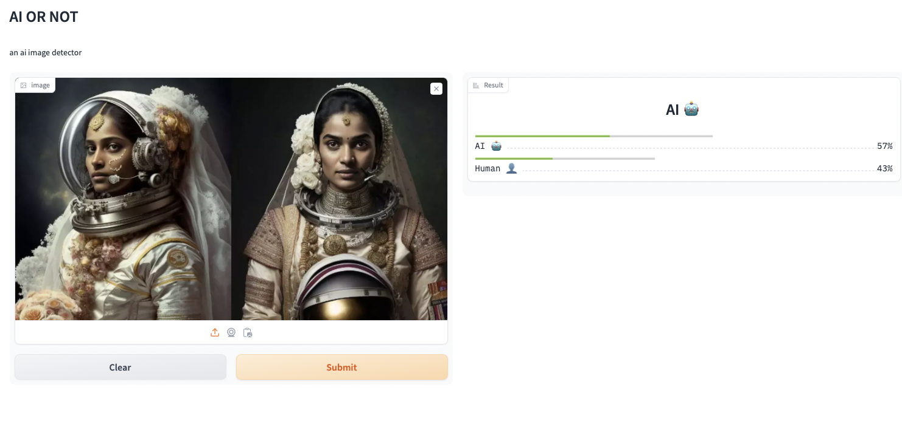

# AI Or Not

**Hosted [here](http://18.234.51.228:11700)** 

The purpose of this project is to learn the concepts presented in FSDL 2022 by building, training and deploying my own model. The model is purposely chosen to be as simple as possible so not to spend too much time on model architecture and instead focus on the other parts of the deep learning stack.

### Building the model

As stated above, in building the model, I kept it as simple as possible. I built a [ResNet](https://arxiv.org/pdf/1512.03385.pdf) from "scratch" using pytorch by stacking convolution/batchnorm/relu layers on top of each other.

The model takes in an image and outputs a prediction that states how confident it is that it is AI generated.

### Choosing a dataset

For the  dataset,  I went with the [aiornot dataset](https://huggingface.co/datasets/competitions/aiornot) from huggingface. This dataset has 62 060 rows with each row containing and id, the image and a label indicating wether the image is generated or not.

### Training

To train the model, on top of vanilla pytorch I used pytorch lightning which helps organize the training code and provides all the neccessary tools for logging metrics.

### Experiment Tracking

In order to help us track all the important metrics, I used wandb. With pytorch lightning, integrating wandb into our training code is trivial. In addition to helping with tracking training metrics, wandb also allows us to save the model at configurable intervals as artifacts. This is really helpful, especially when you are training in a free google collab notebook, where you can lose all your training if your model disconnects.

### Troubleshooting & Testing

Training is expensive. Before starting we need to make sure that everything is working correctly using different tests and fix any problems when they arise by using troubleshooting tools. To test our code we use pytest (not used here). To test our data we use pydantinc (not used here). To test our model, we use a memorization test, to see wether our model can effectively overfit on a batch. This helps us avoid any catastrophic failures although small bugs can slip through. We also use pytorch profiler to make sure we are effectively utilizing our GPU.

### Web Deployment

To deploy the model I used gradio for my frontend and an aws serverless backend. In the future, I would like to deploy my projects with a custom frontend but alas my skills are not there yet.
